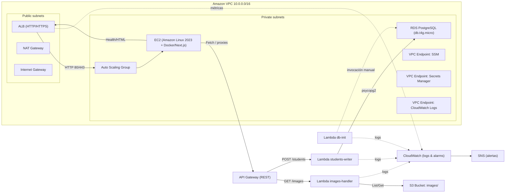

# Informe Técnico y Estimación de Costos — NexaCloud (Servicios en la Nube 2025-02)

> **Ambiente:** `dev` · Región: `us-east-1`  
> **Fecha:** 2025-11-06

---

## 1) Resumen ejecutivo

Se implementó una plataforma mínima viable (MVP) en AWS que cumple los 6 requerimientos del proyecto: página web en EC2 detrás de un **ALB**, visualización de **datos en RDS**, galería de **imágenes** obtenidas por **API Gateway + Lambda** desde **S3**, un endpoint **Lambda** que inserta estudiantes en la base de datos, **monitoreo con CloudWatch + SNS**, y validación del **balanceador** con múltiples instancias. Todo se aprovisionó como infraestructura como código (Terraform) y se conectó a la aplicación con variables leídas desde SSM.

Puntos clave:
- **Seguridad por defecto**: bucket S3 no público, API Gateway protegido con **API Key**, RDS en subred privada con **Security Groups**, acceso a parámetros sensibles vía **SSM Parameter Store** e IAM de mínimo privilegio.
- **Observabilidad**: logs y métricas en CloudWatch, alarmas 5xx para ALB y API GW, errores de Lambdas, CPU/almacenamiento de RDS; notificación por SNS.
- **Escalabilidad/Disponibilidad**: ASG con al menos 1 `t3.micro`, ALB público, Lambdas sin servidor. El diseño separa datos y computo en subredes privadas.

---

## 2) Arquitectura (alto nivel)



### Componentes
- **ALB (público)** recibe todo el tráfico HTTP y distribuye a EC2 (ASG).
- **EC2 (ASG)** entrega la Web Page y rutas `/monitoring`, `/stress` y `/proxy` que integran con la capa de backend.
- **API Gateway (REST)** expone `/images` (GET) y `/students` (POST).
- **Lambda `images`** lista objetos `images/` en S3 y retorna URLs prefirmadas.
- **Lambda `students-writer`** normaliza payloads (JSON y `application/x-www-form-urlencoded`) e inserta en `public.estudiante`.
- **Lambda `db-init`** crea tabla y carga datos iniciales.
- **RDS PostgreSQL** (puerto 9876) en subred privada.
- **S3 (images/)** almacena fotos; el bucket **no es público**.
- **SSM Parameter Store** guarda `db/host`, `db/port`, `db/name`, `db/user`, `db/master_password`, URLs y API Keys.

---

## 3) Seguridad y mejores prácticas

- **Red**: RDS y Lambdas en subredes privadas; acceso a RDS únicamente desde Lambdas/instancias vía SG. SSH deshabilitado o movido de `:22`.
- **Identidades**: roles IAM con privilegios mínimos (p. ej., Lambdas `images` con `s3:ListBucket` y `s3:GetObject` restringidos al bucket).
- **Datos sensibles**: credenciales/URLs en **SSM Parameter Store** (`SecureString` cuando aplica). Nada de secretos en imágenes Docker.
- **API**: **API Key** en API Gateway, validada por etapa y usage plan.
- **S3**: bloqueos de acceso público activados; solo acceso desde Lambda/roles.
- **Registro**: Logs de ALB, API GW, Lambdas y sistema; retención definida; métricas y alarmas en CloudWatch.

---

## 4) Entregables por pestaña (cómo se cumplen)

1. **Web Page**: página estática servida desde EC2 tras ALB; muestra nombre de la empresa.  
2. **Datos BD**: `RDS PostgreSQL` con tabla `public.estudiante`; lectura desde la app.  
3. **Imágenes en bucket**: vista que consume `/images` en API GW → Lambda `images` → S3 (`images/`).  
4. **Lambda function**: formulario que envía a `/students` (API GW) → Lambda `students-writer` → `INSERT` en RDS.  
5. **Monitoreo y alertas**: métricas y **alarmas** (ALB 5xx, API GW 5xx, errores Lambda, CPU y free storage de RDS) notificadas por **SNS**.  
6. **Balanceador de carga**: página `/monitoring` que embebe contenido servido por el **ALB** (cambia entre instancias; muestra ID de servidor).

---

## 5) Operación y despliegue

- **User-data EC2**: prepara `.env`, clona el repo, verifica `docker-compose.yml`, levanta la app y configura `buildx` cuando se usa Docker.  
- **Lambdas**: empaquetadas (zip); variables de entorno mínimas; VPC/VPC endpoints; permisos S3/SSM.  
- **RDS**: inicialización con `db-init`; el puerto externo **9876** se usa solo para validación.
- **Pruebas rápidas**:  
  ```bash
  # Imágenes
  curl -H "x-api-key: $APIKEY" "$IMAGES_URL"

  # Escritura estudiantes (JSON)
  curl -H "x-api-key: $APIKEY" -H "Content-Type: application/json"        -d '{"nombre":"Mariana","apellido":"Hernández","correo_electronico":"mari@prueba.com"}'        "$STUDENTS_URL"

  # Escritura estudiantes (form-urlencoded)
  curl -H "x-api-key: $APIKEY" -H "Content-Type: application/x-www-form-urlencoded"        --data 'nombre=Mariana&apellido=Hernandez&correo_electronico=mari@prueba.com'        "$STUDENTS_URL"
  ```

---

## 6) Monitoreo

**Dashboards** y **Alarmas** en CloudWatch:  
- ALB `HTTPCode_ELB_5XX_Count` y `TargetResponseTime`  
- API GW `5XXError`, `4XXError`, `Count`  
- Lambda `Errors`, `Throttles`, `Duration`  
- RDS `CPUUtilization`, `FreeStorageSpace`, `DatabaseConnections`  
- Notificación por **SNS** (correo/HTTP).

---

## 7) Estrés & validación

- Ruta **`/stress?duration=SECONDS`** en la app para generar carga (CPU/IO) controlada en la instancia.  
- Página **`/monitoring`** refresca cada segundo el contenido servido por el ALB y muestra el **ID de servidor** activo para evidenciar balanceo.

---

## 8) Estimación de costos (6 meses)

**Base mensual estimada (Infracost): ~ USD 152**  
Principales impulsores fijos mensuales:
- NAT Gateway ~ **$33**
- ALB ~ **$16**
- EC2 t3.micro ~ **$15**
- VPC Endpoints (EC2/ECR/Logs/SSM/Secrets, 5 × $15) ~ **$75**
- RDS db.t4g.micro + almacenamiento ~ **$14**
- Secrets Manager ~ **$0.40**
- Alarmas CloudWatch (≈6) ~ **$0.60**

**Total base 6 meses:** `152 × 6 = USD 912` (sin uso).

Componentes **dependientes de uso** (valores típicos de AWS):  
- API Gateway: **$3.50 / 1M** solicitudes.  
- Lambda: **$0.20 / 1M** invocaciones + **$0.0000166667 / GB-s** + almacenamiento efímero **$0.0000000309 / GB-s**.  
- S3: almacenamiento **$0.023 / GB**, solicitudes `PUT/LIST` **$0.005 / 1k**, `GET` **$0.0004 / 1k**.  
- CloudWatch Logs/Insights: **$0.50 / GB** ingerido; **$0.005 / GB** escaneado.

### Escenarios de consumo (ilustrativos)
| Escenario | API calls/mes | Lambda invocaciones/mes | Duración (256MB, 200ms prom.) | S3 GET/mes | Costo uso aprox. |
|---|---:|---:|---:|---:|---:|
| Bajo | 50k | 50k | 10k GB-ms | 10k | ~ **$0.30** |
| Medio | 1M | 1M | 200k GB-ms | 100k | ~ **$4–5** |
| Alto | 10M | 10M | 2M GB-ms | 1M | ~ **$40–50** |

> **Conclusión de costos**: el gasto dominante del piloto es **fijo** (ALB, NAT, endpoints, EC2, RDS). Optimizable migrando a **ALB + Fargate/Lambda-only**, reduciendo **NAT/endpoints**, o consolidando ambientes.

---

## 9) Riesgos y mitigaciones

- **Exposición involuntaria de datos** → S3 no público, políticas IAM mínimas, API Key obligatoria y rotación.  
- **Escalado de costos por NAT/Endpoints** → evaluar VPC endpoints estrictamente necesarios o patrones serverless sin VPC.  
- **Conectividad RDS** → mantener en privado, tiempo de espera bajo, pooling en Lambdas si aplica.  
- **Observabilidad insuficiente** → dashboards+alarmas predefinidos y pruebas de notificación periódicas.

---

## 10) Referencias operativas

- Terraform módulos: VPC, ALB, ASG, RDS, SSM, API GW, Lambdas.  
- Procedimientos de prueba (`curl`), y tableros CloudWatch.  
